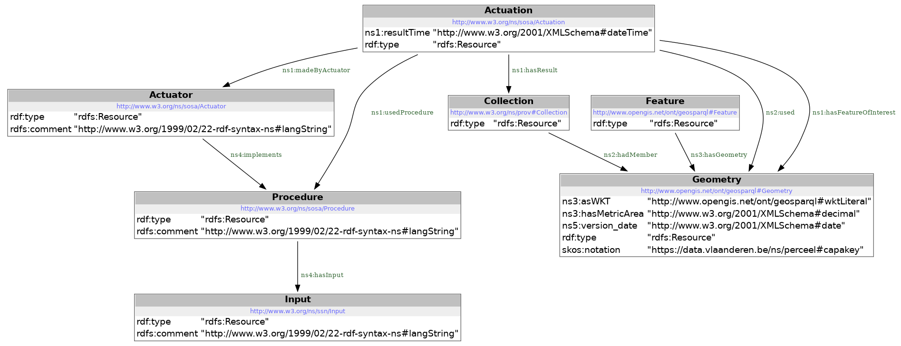
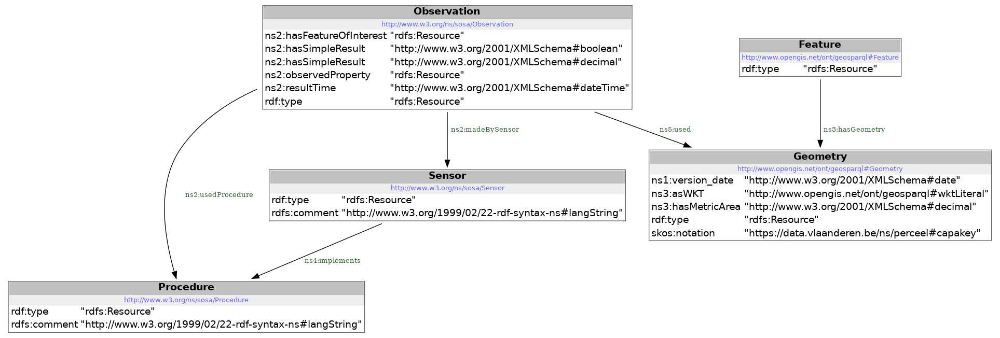
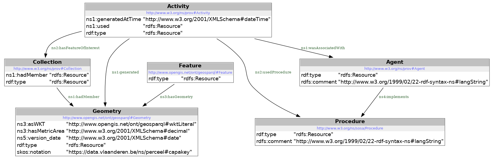

# BRDR-provenance

Voor een proces van heraligneren van beschermde gebieden ten opzichte van percelen, waarvan de grenzen werden gecorrigeerd, zijn volgende stappen te onderscheiden:
1. aligneren en voorstellen van verschillende alternatieven
2. evaluatie van de gegenereerde alternatieve aanpassingen op overlap ten opzichte van de percelen
3. het vergelijken van de verschillende resultaten
4. de keuze van 1 bepaald alignment 
   
Van dit proces willen we de volledige provenance capteren.

## Alignment

## Evaluatie

## Selectie

